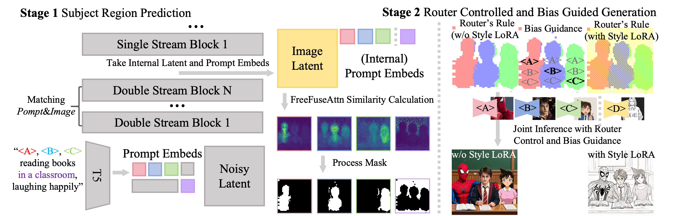

# FreeFuse: Multi-Subject LoRA Fusion via Adaptive Token-Level Routing at Test Time

<p align="center">
  
</p>

<p align="center">
  <em>FreeFuse enables seamless multi-subject composition by fusing multiple LoRAs without additional training or user-defined masks.</em>
</p>

[](https://arxiv.org/abs/2510.23515)

## 📌 TODO

- [x] Release basic inference code
- [x] Release inference code for controlnet, ipadapter and redux
- [x] Supports ComfyUI
- [x] Supports Z-Image-turbo in diffusers
- [x] Supports Z-Image-turbo in ComfyUI
- [ ] Supports FLUX.2-klein-4B/9B  in diffusers
- [ ] Supports FLUX.2-klein-4B/9B in ComfyUI

## 📖 Abstract

This paper proposes **FreeFuse**, a training-free framework for multi-subject text-to-image generation through automatic fusion of multiple subject LoRAs. In contrast to prior studies that focus on retraining LoRA to alleviate feature conflicts, our analysis reveals that simply spatially confining the subject LoRA's output to its target region and preventing other LoRAs from directly intruding into this area is sufficient for effective mitigation. Accordingly, we implement **Adaptive Token-Level Routing** during the inference phase. We introduce **FreeFuseAttn**, a mechanism that exploits the flow matching model's intrinsic semantic alignment to dynamically match subject-specific tokens to their corresponding spatial regions at early denoising timesteps, thereby bypassing the need for external segmentors. FreeFuse distinguishes itself through high practicality: it necessitates no additional training, model modifications, or user-defined masks spatial conditions. Users need only provide subject activation words to achieve seamless integration into standard workflows. Extensive experiments validate that FreeFuse outperforms existing approaches in both identity preservation and compositional fidelity.

## 🎨 Results

### Results on Flux.dev

<p align="center">
  
</p>

<p align="center">
  <em>Qualitative results on Flux.dev. FreeFuse achieves superior identity preservation and compositional fidelity.</em>
</p>

### Results on SDXL

<p align="center">
  
</p>

<p align="center">
  <em>Additional comparisons demonstrating FreeFuse's effectiveness on SDXL.</em>
</p>

## 🏗️ Architecture

<p align="center">
  
</p>

<p align="center">
  <em>Overview of FreeFuse architecture. FreeFuseAttn dynamically routes subject-specific LoRAs to their corresponding spatial regions via adaptive token-level routing, enabling training-free multi-subject LoRA fusion.</em>
</p>

## 🚀 Quick Start

### Installation with ComfyUI

```shell
# use comfy-cli
pip install comfy-cli
comfy node install freefuse

# or manual installation
git clone https://github.com/yaoliliu/FreeFuse.git
ln -s /path/to/FreeFuse/freefuse_comfyui <your ComfyUI path>/custom_nodes
```

You can find workflows for flux.dev and SDXL in the `freefuse_comfyui/workflows` folder. (*^▽^*)

### Installation with diffusers

You just need clone this repo and use [uv](https://docs.astral.sh/uv/) to install dependencies.

``` shell
apt-get update && apt-get install -y git-lfs && git lfs install
git clone https://github.com/yaoliliu/FreeFuse.git
git lfs pull
# or using huggingface if lfs budget is used up
hf download lsmpp/freefuse_example_loras --local-dir=./loras

uv venv
source .venv/bin/activate
uv sync
```

### Running on Flux

without background identification

``` shell
python main_freefuse_flux.py
```

with background identification and style LoRA

``` shell
python main_freefuse_flux_bg_except.py
```

with redux
``` shell
python redux_freefuse_flux_bg_except.py
```

with ipadapter
``` shell
python ipadapter_freefuse_flux_bg_except.py
```

with controlnet
``` shell
python controlnet_freefuse_flux_bg_except.py
```

*If you running out of your vram, you can set the quantization variable in the script to 'True' to enable quantization, which will reduce the vram usage.*

### Running on SDXL

``` shell
python main_freefuse_sdxl.py
```

### Running on Z-Image-turbo

``` shell
python main_freefuse_z_image.py
```

## Acknowledgement

Thanks for [Tekemo](https://civarchive.com/users/Tekemo) and [jrewingwannabe947](https://civitai.com/user/jrewingwannabe947)'s ZIT LoRAs, which are used in our Z-Image-turbo examples.

<p align="center">
  
</p>

<p align="center">
  <em>FreeFuse solves feature conflicts between multiple subject LoRAs without additional training in flux1.dev, sdxl, z-image and more.</em>
</p>


