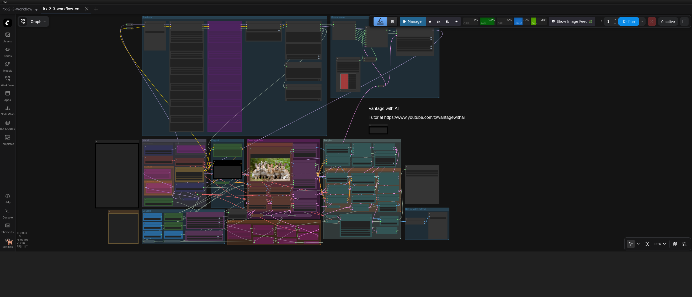

# FreeFuse LTX-Video Workflow Guide

## Complete FreeFuse LTX-Video Workflow

### Workflow Preview



*Complete LTX-Video 2.3 workflow with FreeFuse multi-concept LoRA composition*

### Optimal Node Chain for LTX-Video with Multiple LoRAs

```
[6-LoRA Stacked Loader] → [Background Loader] → [Token Positions]
                                                      ↓
                                    [LTXSimilarityExtractor] or [LTXBlockGridExtractor]
                                                      ↓
                                         [RawSimilarityOverlay]
                                         - sensitivity: 5.0
                                         - max_iter: 15
                                         - balance_lr: 0.01
                                         - gravity: 0.00004
                                         - spatial: 0.00004
                                         - momentum: 0.2
                                                      ↓ (refined_masks)
                                         [MaskRefiner] ← Optional
                                         - fill_holes: True
                                         - morph_operation: close
                                         - remove_small: True
                                                      ↓ (refined_masks)
                                         [MaskApplicator]
                                         - mask_source: similarity_maps
                                         - enable_attention_bias: True
                                         - bias_scale: 5.0
                                                      ↓
                                         [KSampler Phase 2]
                                                      ↓
                                         [SaveImage/SaveVideo]
```

---

## LTX-Video Architecture

| Component | Value |
|-----------|-------|
| **Transformer Class** | `AVTransformer3DModel` |
| **Num Layers** | 48 blocks |
| **Num Attention Heads** | 32 |
| **Attention Head Dim** | 128 |
| **Cross Attention Dim** | 4096 |
| **Positional Embedding** | RoPE (split type) |
| **QK Norm** | RMS Norm |
| **Latent Channels** | 128 |
| **VAE** | CausalVideoAutoencoder (3D) |

**Key Differences from Qwen-Image:**
- 48 blocks (vs 60 in Qwen-Image)
- 32 attention heads (vs 64 in Qwen-Image)
- 5D latents for video: (B, C, T, H, W)
- Uses Gemma 3 text encoder (12B)

---

## Node Settings

### 1. FreeFuseLTXSimilarityExtractor

```yaml
collect_block: 20-30        # Best for LTX-Video (middle blocks)
collect_step: 1             # Collect at first step
steps: 2-3                  # Minimum for extraction
temperature: 4000.0         # Default temperature
top_k_ratio: 0.3            # 30% of tokens
low_vram_mode: True         # Essential for multiple LoRAs
attention_head_index: -1    # -1 = average all 32 heads
```

### 2. FreeFuseLTXBlockGridExtractor

```yaml
block_start: 0              # Start block
block_end: 47               # End block (max 47)
collect_step: 1             # Collect at first step
steps: 2-3                  # Minimum for extraction
temperature: 4000.0         # Default temperature
top_k_ratio: 0.3            # 30% of tokens
cell_size: 128              # Size of each block cell
preview_size: 512           # Grid preview size
```

### 3. FreeFuseRawSimilarityOverlay

```yaml
sensitivity: 5.0            # Moderate contrast
preview_size: 1024          # Output preview size
argmax_method: stabilized   # Balanced with spatial constraints
max_iter: 15                # Iterations for stabilized argmax
balance_lr: 0.01            # Learning rate
gravity_weight: 0.00004     # Centroid attraction
spatial_weight: 0.00004     # Neighbor influence
momentum: 0.2               # Smoothing
anisotropy: 1.3             # Horizontal stretch (important for video!)
bg_scale: 0.95              # Background multiplier
use_morphological_cleaning: True
```

**Output:** `refined_masks` (FREEFUSE_MASKS)

### 4. FreeFuseMaskRefiner ← Optional

```yaml
fill_holes: True
max_hole_size: 50
morph_operation: close
kernel_size: 3
iterations: 1
remove_small_regions: True
min_region_size: 100
smooth_boundaries: False
apply_threshold: False
```

**Purpose:** Clean up masks before applying to LoRAs

### 5. FreeFuseMaskApplicator

```yaml
mask_source: "similarity_maps"    # Use soft similarity weights
enable_token_masking: True
enable_attention_bias: True
bias_scale: 5.0
positive_bias_scale: 1.0
bidirectional: True
```

### 6. KSampler (Phase 2)

```yaml
steps: 20-28
cfg: 3.5
sampler_name: euler / dpmpp_2m
scheduler: simple / beta
```

---

## Parameter Guide

### Block Selection for LTX-Video

| Block Range | Quality | Use |
|-------------|---------|-----|
| 0-15 | Early features | Not recommended |
| **16-25** | **Good separation** | **Recommended starting point** |
| 26-35 | Transition | Test if 25 doesn't work |
| 36-42 | Deep concepts | Complex scenes |
| 43-47 | Overlapping | Use for blending |

**Recommended workflow:**
1. Start with `LTXBlockGridExtractor` to scan blocks 0-47
2. Visually identify blocks with clean concept separation
3. Use `LTXSimilarityExtractor` with the best block number

### Attention Head Selection

| Head Index | Effect |
|------------|--------|
| -1 | Average all 32 heads (default, recommended) |
| 0-31 | Use specific head (for debugging) |

**Tip:** Some heads may show cleaner separation for specific concepts. Use `LTXBlockGridExtractor` to find the best head.

### MaskRefiner Settings

| Problem | Solution |
|---------|----------|
| Holes in masks | `fill_holes: True`, `max_hole_size: 50-100` |
| Rough edges | `morph_operation: close`, `kernel_size: 3-5` |
| Noise speckles | `remove_small_regions: True`, `min_region_size: 100` |
| Temporal flickering | Consider using same mask for all frames |

### MaskApplicator: mask_source

| Option | Effect | When to Use |
|--------|--------|-------------|
| `argmax_masks` | Hard masks, one concept per pixel | Clean separation needed |
| `similarity_maps` | Soft weights, blending allowed | Natural transitions (recommended) |

---

## Troubleshooting

### Problem: Masks have holes

**Solution 1:** Increase `max_hole_size` in MaskRefiner
```yaml
max_hole_size: 100  # Increase from 50
```

**Solution 2:** Use morphological closing
```yaml
morph_operation: close
kernel_size: 5      # Increase from 3
iterations: 2       # Increase from 1
```

### Problem: Concepts overlap/bleed

**Solution 1:** Lower temperature in LTXSimilarityExtractor
```yaml
temperature: 3000  # Decrease from 4000
```

**Solution 2:** Use argmax_masks instead
```yaml
MaskApplicator.mask_source: "argmax_masks"
```

**Solution 3:** Increase gravity/spatial weights
```yaml
gravity_weight: 0.00006
spatial_weight: 0.00006
```

### Problem: Poor separation at block 20

**Solution:** Try nearby blocks
```yaml
collect_block: 25  # Or 30, 15
```

Use `LTXBlockGridExtractor` to find the optimal block.

### Problem: Slow generation

**Solution 1:** Reduce LTXBlockGridExtractor preview size
```yaml
preview_size: 512  # Decrease from 1024
cell_size: 64      # Decrease from 128
```

**Solution 2:** Reduce block range
```yaml
block_start: 16
block_end: 35      # Scan fewer blocks
```

### Problem: VRAM errors / OOM

**Solution 1:** Reduce latent size (spatial and temporal)
```yaml
# Use smaller width/height and fewer frames
```

**Solution 2:** Enable low_vram_mode
```yaml
low_vram_mode: True
```

**Solution 3:** Reduce batch size to 1
```yaml
batch_size: 1
```

**Solution 4:** Use fewer blocks in grid extractor
```yaml
block_start: 20
block_end: 30      # Only scan 11 blocks
```

---

## Video-Specific Considerations

### Temporal Dimension

LTX-Video uses 5D latents: `(B, C, T, H, W)`

- **T (temporal)**: Number of frames
- **H, W (spatial)**: Frame dimensions

**Important:** The similarity extraction operates on the flattened sequence `(T * H * W)`. The preview shows the first frame by default.

### Temporal Consistency

For consistent masks across frames:
1. Extract similarity at a single step
2. Use the same masks for all frames
3. Consider using `MaskRefiner` with temporal smoothing (future feature)

### Recommended Latent Sizes

| Resolution | Frames | VRAM Usage | Use Case |
|------------|--------|------------|----------|
| 32x32 | 8-16 | Low | Testing, fast iteration |
| 48x48 | 8-16 | Medium | Quality testing |
| 64x64 | 8-16 | High | Final generation |

---

## Comparison: LTX-Video vs Qwen-Image

| Feature | LTX-Video | Qwen-Image |
|---------|-----------|------------|
| Blocks | 48 | 60 |
| Attention Heads | 32 | 64 |
| Head Dim | 128 | 128 |
| Latents | 5D (video) | 5D (image) |
| Text Encoder | Gemma 3 (12B) | Qwen 3 |
| Best Blocks | 16-30 | 16-30 |
| VRAM Usage | Higher (video) | Lower (image) |

---

## Example Workflow Settings

### Fast Testing (Low VRAM)

```yaml
# LTXSimilarityExtractor
collect_block: 24
steps: 2
temperature: 4000
top_k_ratio: 0.3
low_vram_mode: True
preview_size: 256

# RawSimilarityOverlay
preview_size: 512
max_iter: 10
```

### Quality Generation (High VRAM)

```yaml
# LTXSimilarityExtractor
collect_block: 24
steps: 3
temperature: 4000
top_k_ratio: 0.3
low_vram_mode: False
preview_size: 512

# LTXBlockGridExtractor (for finding best block)
block_start: 16
block_end: 35
cell_size: 128
preview_size: 1024

# RawSimilarityOverlay
preview_size: 1024
max_iter: 20
gravity_weight: 0.00006
spatial_weight: 0.00006
```

---

## Why This Workflow Works

| Node | Purpose | Key Benefit |
|------|---------|-------------|
| **LTXSimilarityExtractor** | Extract at block 20-30 | Best concept separation for LTX |
| **LTXBlockGridExtractor** | Scan all blocks | Find optimal block visually |
| **RawSimilarityOverlay** | Fine-tune with params | Your optimized settings |
| **MaskRefiner** | Fill holes, cleanup | Clean masks for generation |
| **MaskApplicator** | Apply as soft weights | Smooth blending |
| **KSampler** | Generate final video | High quality output |

---

## Tips for Best Results

1. **Start with Block Grid**: Use `LTXBlockGridExtractor` first to find the best block range for your specific concepts.

2. **Use Middle Blocks**: Blocks 16-30 typically show the best concept separation.

3. **Enable Low VRAM Mode**: Essential when using multiple stacked LoRAs.

4. **Adjust Anisotropy**: For non-square latents, adjust `anisotropy` in `RawSimilarityOverlay`.

5. **Test Temperature**: Lower temperature (3000) for cleaner separation, higher (5000) for more blending.

6. **Use MaskRefiner**: If masks have holes or rough edges, enable the mask refiner.

7. **Soft vs Hard Masks**: Start with `similarity_maps` (soft), switch to `argmax_masks` (hard) if you need clean boundaries.
