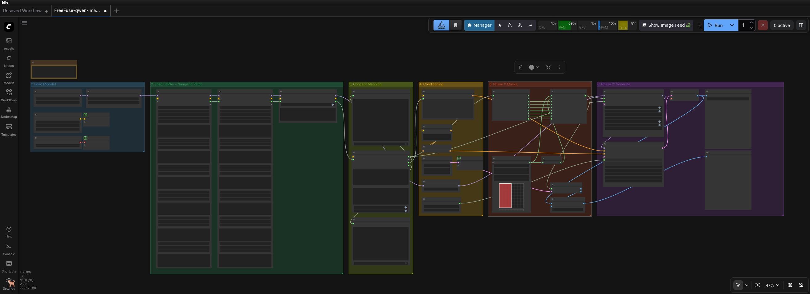

# FreeFuse

**FreeFuse** is a ComfyUI custom nodes package for multi-concept LoRA composition using attention-based mask generation.


## Workflow Overview



## What FreeFuse Does


*FreeFuse enables precise multi-concept LoRA composition by generating attention-based masks that separate different characters/objects in the image.*

## Example Workflows

| Workflow | Description |
|----------|-------------|
| [**Qwen-Image SAM Masks**](dev_workflows/FreeFuse-qwen-image-sam-mask.json) | Qwen-Image with SAM (Segment Anything) AI masks |
| [**Qwen-Image Manual Masks**](dev_workflows/FreeFuse-qwen-image-manual-mask.json) | Qwen-Image with manual mask input |
| [**Z-Image SAM Masks**](dev_workflows/FreeFuse-zimage-sam-mask.json) | Z-Image with SAM (Segment Anything) AI masks |
| [**Z-Image Manual Masks**](dev_workflows/FreeFuse-zimage-manual-mask.json) | Z-Image with manual mask input |
| [**Z-Image Standard**](dev_workflows/FreeFuse-zimage-standard.json) | Z-Image with attention-based masks |

## Features

- **Multi-LoRA Composition** - Stack up to 6 LoRAs per character
- **Attention-Based Masks** - Auto-generate masks from attention patterns
- **Manual Mask Support** - Use your own masks or SAM-generated masks
- **Qwen-Image & Z-Image** - Full support for both architectures
- **VRAM Optimized** - Aggressive memory management for multi-LoRA

## Our Contributions

This fork extends the original FreeFuse implementation with:

- **Qwen-Image Support** - Full integration for Qwen-Image MMDiT architecture (60 transformer blocks)
- **Stacked LoRA Loader** - Load up to 6 LoRAs per character adapter (original had none)
- **SAM Integration** - Segment Anything Model support for AI-generated masks
- **Updated TokenPositions** - Improved token position computation for better concept mapping
- **VRAM Optimization** - Aggressive memory management for multi-LoRA workflows
- **Enhanced Workflow** - Streamlined node chain for both Qwen-Image and Z-Image

## The Qwen-Image Challenge

Getting FreeFuse to work with Qwen-Image was no small feat. The model's architecture was a black box - no documentation, no reference implementation, just a 40GB maze of transformer blocks waiting to be decoded.

**What we discovered through reverse engineering:**

- **5D Tensor Mystery** - Qwen-Image expects 5D tensors `(B, C, T, H, W)` instead of the standard 4D. ComfyUI provides 4D. We had to figure out where and how to inject the temporal dimension.

- **60 Transformer Blocks** - Unlike Flux (57 blocks) or SDXL (~30 blocks), Qwen-Image has 60 transformer blocks in a dual-stream MMDiT architecture. Finding the right blocks for attention extraction required extensive testing across the entire range.

- **Dual-Stream Attention** - Qwen-Image processes image and text in separate streams with different QKV projections (`to_q/k/v` for image, `add_q/k/v_proj` for text). We had to map both streams and understand how they interact.

- **QK Normalization Layers** - Separate normalization for image and text queries/keys (`norm_q/k` vs `norm_added_q/k`). Missing this caused silent failures in attention computation.

- **RoPE Frequency Shapes** - Qwen-Image's rotary position embeddings have a completely different structure than Flux. We discovered the similarity maps still work without perfect RoPE by using the attention output directly.

- **Patchified Latents** - The 64x64 latent is processed as 32x32 patches (patch_size=2), giving 1024 tokens instead of 4096. This caused massive confusion until we traced the sequence length back to the patchification.

- **VRAM Nightmares** - Qwen-Image BF16 alone uses ~27GB. With multiple LoRAs, we hit OOM constantly. Solution: aggressive early stopping, moving maps to CPU immediately, and strategic `torch.cuda.empty_cache()` calls at critical points.

**The breakthrough:** After days of debugging, hook installation/removal cycles, and tensor shape detective work, we cracked the basic architecture. But the truth? Qwen-Image is still full of mysteries. The model is surprisingly unpredictable - attention patterns shift between blocks, and what works once might not work again. We've opened the door, but there's still unexplored territory ahead: the 5D tensor space, transformer block interactions, attention head behaviors, and who knows what else. This is ongoing research, not a finished solution.

This wasn't just plugin development - this was digital archaeology, reverse engineering a closed architecture brick by brick. The journey continues.

## Installation

```bash
cd ComfyUI/custom_nodes
git clone <repository-url> FreeFuse
```

Or use **ComfyUI Manager** → Search "FreeFuse" → Install

## Key Nodes

| Node | Purpose |
|------|---------|
| `FreeFuse LoRA Loader (Bypass)` | Load LoRA in bypass mode for FreeFuse |
| `FreeFuse LoRA Loader (Simple)` | Standard LoRA loader (fallback) |
| `FreeFuse 6-LoRA Stacked Loader` | Load up to 6 LoRAs per adapter |
| `FreeFuseTokenPositions` | Define character locations |
| `FreeFuseQwenSimilarityExtractor` | Extract attention masks (Qwen) |
| `FreeFuse Raw Similarity Overlay` | Generate & refine masks |
| `FreeFuseMaskApplicator` | Apply masks to LoRAs |
| `FreeFusePhase1Sampler` | Collect attention masks (Z-Image) |

## Documentation

| File | Description |
|------|-------------|
| [COMPLETE_QWEN_WORKFLOW.md](COMPLETE_QWEN_WORKFLOW.md) | Full Qwen-Image guide |
| [QWEN_IMAGE_OPTIMAL_SETTINGS.md](QWEN_IMAGE_OPTIMAL_SETTINGS.md) | Best parameters |
| [MULTI_LORA_VRAM_OPTIMIZATION.md](MULTI_LORA_VRAM_OPTIMIZATION.md) | VRAM tips |
| [QWEN_IMAGE_SIMILARITY_EXTRACTION.md](QWEN_IMAGE_SIMILARITY_EXTRACTION.md) | Technical details |

## Quick Tips

- **Qwen-Image blocks**: Use 20-30 for best separation
- **VRAM**: Enable `low_vram_mode` for 2+ LoRAs
- **Steps**: 2-3 steps enough for mask extraction
- **Latent size**: 32x32 for testing, 64x64 for final

## Support

- **Issues**: GitHub Issues
- **Discussions**: GitHub Discussions

## Credits

This project is based on the original **FreeFuse** implementation by **Yaoli Liu** [@yaoliliu](https://github.com/yaoliliu), a Master's student in Computer Science at [Zhejiang University](https://www.zju.edu.cn/), specializing in Generative Models.

**Contributor Recognition:** Michel "Skynet" has been added as a contributor to the FreeFuse dev channel for his Qwen-Image integration work.

---

**Michel "Skynet"** - Author  
**Qwen** - State-of-the-Art AI Coder | 80GB Active Memory | Polishing 16 CPU Cores | [Qwen3-Coder-Next-Q8](https://huggingface.co/Qwen) | *"He is my buddy"*

**FreeFuse** - Precise multi-concept generation through attention-based mask fusion.
