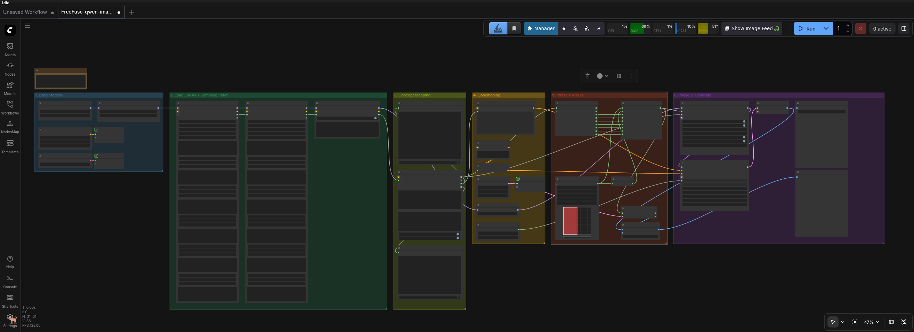

# Z-Image FreeFuse Guide

## Overview

FreeFuse nodes for Z-Image (Lumina2/NextDiT) multi-concept LoRA composition using attention-based masks.

**Status:** ✅ Fully implemented and tested



---

## Quick Start

### Standard Workflow
```
6-LoRA Loader → Background Loader → Token Positions → Phase1Sampler
                                              ↓
                                 RawSimilarityOverlay → MaskApplicator → KSampler
```

### Manual Mask Workflow
```
Phase1Sampler → RawSimilarityOverlay → MaskTap → MaskReassemble → MaskApplicator → KSampler
```

---

## Z-Image Architecture

| Component | Value |
|-----------|-------|
| **Model Class** | Lumina2/NextDiT |
| **Architecture** | Unified sequence [txt, img] |
| **Transformer Blocks** | Layered stack (layers.{i}) |
| **Attention Type** | Joint attention |
| **Text Encoder** | Qwen 3 (4B) |
| **VAE** | ae.safetensors |
| **Model Sampling** | AuraFlow (shift=3.0) |

**Sequence Order:** [text, image] (text FIRST in ComfyUI)

**System Prompt:** Required for token position alignment with CLIPTextEncodeLumina2

---

## Nodes

### FreeFusePhase1Sampler

Extract similarity maps during Phase 1 sampling.

| Parameter | Default | Description |
|-----------|---------|-------------|
| `collect_block` | 20 | Block to collect from |
| `collect_step` | 1 | Step at which to collect |
| `steps` | 3 | Sampling steps (2-3 enough) |
| `temperature` | 4000.0 | Similarity temperature |
| `top_k_ratio` | 0.3 | Top-k token ratio |
| `low_vram_mode` | True | VRAM optimization |

### FreeFuseTokenPositions

Compute token positions for Z-Image.

| Parameter | Default | Description |
|-----------|---------|-------------|
| `injection_text` | "" | Location injections |
| `user_text` | "" | User prompt |
| `filter_meaningless` | True | Filter noise tokens |
| `filter_single_char` | True | Filter single chars |

**System Prompt:** Auto-applied for Z-Image alignment

### FreeFuseRawSimilarityOverlay

Visualize and refine similarity maps.

| Parameter | Default | Description |
|-----------|---------|-------------|
| `sensitivity` | 5.0 | Contrast amplification |
| `max_iter` | 15 | Stabilized argmax iterations |
| `gravity_weight` | 0.00004 | Centroid attraction |
| `spatial_weight` | 0.00004 | Neighbor influence |
| `anisotropy` | 1.3 | Horizontal stretch |

### FreeFuseMaskApplicator

Apply masks to LoRAs.

| Parameter | Default | Description |
|-----------|---------|-------------|
| `mask_source` | similarity_maps | Soft or hard masks |
| `enable_attention_bias` | True | Use attention bias |
| `bias_scale` | 5.0 | Bias strength |
| `bias_blocks` | double_stream_only | Which blocks to bias |

---

## Block Selection Guide

| Block Range | Quality | Use |
|-------------|---------|-----|
| 0-15 | Early features | Debug only |
| **16-25** | **Best separation** | **Recommended** |
| 26-35 | Transition | Test if needed |
| 36+ | Deep concepts | Complex scenes |

**Tip:** Start with block 20-25 for best concept separation.

---

## Model Files

```
Diffusion:          z_image_turbo_bf16.safetensors
                    https://huggingface.co/Comfy-Org/z_image_turbo/resolve/main/split_files/diffusion_models/z_image_turbo_bf16.safetensors

Text Encoder:       Qwen3-4B.safetensors
                    https://huggingface.co/Comfy-Org/z_image_turbo/resolve/main/split_files/text_encoders/Qwen3-4B.safetensors

VAE:                ae.safetensors
                    https://huggingface.co/Comfy-Org/z_image_turbo/resolve/main/split_files/vae/ae.safetensors

Model Sampling:     AuraFlow shift=3.0
KSampler:           steps=4, cfg=1.0, sampler_name=euler, scheduler=beta
```

**Download:** https://huggingface.co/Comfy-Org/z_image_turbo

---

## Performance

### VRAM Usage

| Configuration | VRAM |
|---------------|------|
| Z-Image BF16 | ~20-25GB |
| + 1 LoRA | +1-2GB |
| + 2 LoRAs | +2-4GB |

### Recommended Settings

**Minimal VRAM (2+ LoRAs):**
```yaml
latent: 32x32 (256x256 image)
steps: 2, collect_step: 1
collect_block: 20
low_vram_mode: True
```

**Balanced:**
```yaml
latent: 48x48 (384x384 image)
steps: 3, collect_step: 1
collect_block: 25
low_vram_mode: True
```

**Quality:**
```yaml
latent: 64x64 (512x512 image)
steps: 3, collect_step: 1
collect_block: 25
```

---

## Troubleshooting

| Problem | Solution |
|---------|----------|
| No similarity maps | Check hook installed, collect_step < steps |
| VRAM errors | Reduce latent size, enable low_vram_mode |
| Poor separation | Try different block (20, 25, 30) |
| Token positions empty | Verify concept text in prompt, check system prompt |
| Masks have holes | Enable morphological cleaning |
| Concepts overlap | Lower temperature, use argmax_masks |

---

## Technical Notes

### Unified Sequence

Z-Image uses unified [txt, img] sequence (text FIRST):

```
Sequence: [text_tokens, image_tokens]
          ^           ^
          |           |
       First       Then
```

### System Prompt

Required for token alignment with CLIPTextEncodeLumina2:

```python
LUMINA2_SYSTEM_PROMPT = (
    "You are an assistant designed to generate superior images..."
)
```

Auto-applied by FreeFuseTokenPositions for Z-Image.

### Attention Bias

- Default: `enable_attention_bias: True`
- Recommended: `bias_scale: 5.0`, `positive_bias_scale: 1.0`
- Blocks: `double_stream_only`

### Model Sampling

Uses AuraFlow sampling with shift=3.0:

```yaml
ModelSamplingAuraFlow:
  shift: 3.0
```

---

## References

- **Z-Image**: https://huggingface.co/Comfy-Org/z_image_turbo
- **Paper**: https://arxiv.org/abs/2501.00103
